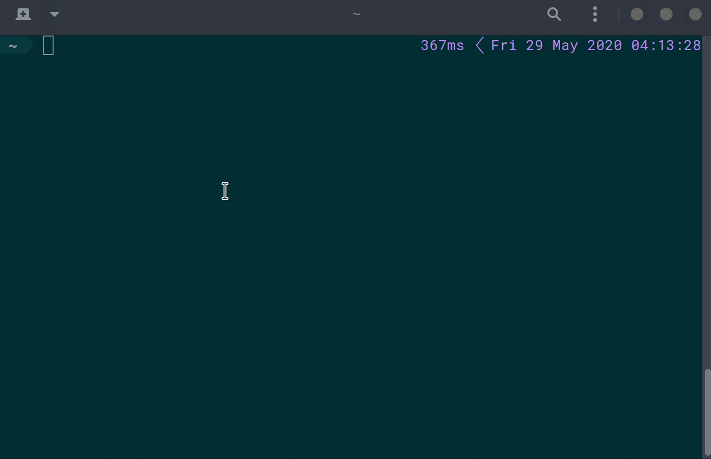

# Dotfiles backup reminder

This script will helps to remind you what sort of files are backup-able in your `$HOME`.

This is intented to be used alongside with some sort of dotfiles backup tools,
such as: [yadm](https://github.com/TheLocehiliosan/yadm), [homesick](https://github.com/technicalpickles/homesick), [homeshick](https://github.com/andsens/homeshick), [mackup](https://github.com/lra/mackup), etc.

    

It uses *mackup* to retrieve a list of files that commonly **people would want to backup**. I use *yadm* myself (which uses plain git to do version controls), and **dot_reminder** helps to remind me files that I might want to keep track of with my dotfiles repository.

It allows you to add custom_apps (in addition to the suggestions provided by *mackup*), and once you are certain that you are not interested in the suggested files, you can add config to ignore them.